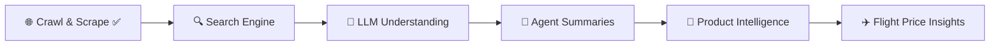

<h2 align="center">🗺️ GcrawlAI Development Roadmap</h2>

  
  
  
  

---

## ✅ Core Engine (Completed)

🟢 <b>Scrape Engine</b>  
🟢 <b>Website Crawling</b>  
🟢 <b>Link Extraction</b>  
🟢 <b>SEO Metadata Extraction</b>  

---

## 🚧 Upcoming Intelligence Features

### 🔍 Search & AI Understanding
🔵 Advanced Search Functionality  
🔵 Scrape + LLM Data Understanding  
🔵 AI Agent Summary Generation  

### 🛒 E-commerce Intelligence
🟣 Flipkart Product Detail Extraction  
🟣 Price • Ratings • Availability Insights  

### ✈️ Travel Intelligence
🟠 Flight Price Extraction  
🟠 Route & Fare Insights  

---

## 🚀 Evolution Path

---

## 🎯 Project Vision

> Transforming web data into **AI-powered intelligence**  
> for developers, businesses, and automation workflows.

✨ Extract structured data  
✨ Understand content using AI  
✨ Deliver actionable insights  
✨ Expand into commerce & travel intelligence  

---

⭐ <b>If you like this project, give it a star!</b> ⭐

