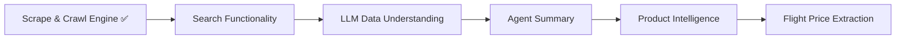

## 🗺️ GcrawlAI Roadmap

### ✅ Completed Core Features
- ✔ Website Crawler Engine
- ✔ Smart Web Scraping
- ✔ Internal & External Link Extraction
- ✔ SEO Metadata Extraction

---

### 🚧 Upcoming Features

#### 🔍 Search & Intelligence
- [ ] Advanced Search Functionality
- [ ] Scrape + LLM Data Understanding
- [ ] AI Agent Summary Generation

#### 🛒 E-commerce Intelligence
- [ ] Flipkart Product Detail Extraction
- [ ] Price, Ratings & Availability Insights

#### ✈️ Travel Data Extraction
- [ ] Flight Price Extraction
- [ ] Route & Fare Insights

---

## 🚀 Development Flow

---

## 🎯 Vision

GcrawlAI is evolving from a **web scraping engine** into an **AI-powered data intelligence platform** capable of:

✔ Extracting structured web data  
✔ Understanding content using LLMs  
✔ Delivering actionable insights  
✔ Supporting e-commerce & travel intelligence  

---

⭐ Stay tuned for exciting updates!
