## 🗺️ GcrawlAI Evolution Roadmap

```mermaid
flowchart LR
    A([🌐 Core Engine]):::done --> B([🔍 Search])
    B --> C([🧠 LLM Understanding])
    C --> D([🤖 Agent Summary])
    D --> E([🛒 Product Intelligence])
    E --> F([✈️ Flight Price Insights])

    classDef done fill:#22c55e,color:#ffffff,stroke:#16a34a,stroke-width:2px;
    classDef active fill:#3b82f6,color:#ffffff,stroke:#2563eb,stroke-width:2px;
    classDef upcoming fill:#e5e7eb,color:#111827,stroke:#9ca3af,stroke-width:2px;

    class A done;
    class B active;
    class C,D,E,F upcoming;
```



---

### ⚡ Progress Journey

🟢 **Core Engine** → Completed  
🔵 **Search Functionality** → In Progress  
⚪ **LLM Understanding & Agent Summary** → Next  
⚪ **Product & Flight Intelligence** → Planned  

---

### 🚀 Feature Evolution Timeline

```
Core Engine        ██████████ 100%
Search Engine      ███████░░░ 70%
LLM Intelligence   █████░░░░░ 50%
Agent Summary      ███░░░░░░░ 30%
Data Intelligence  ██░░░░░░░░ 20%
```

---

✨ Building the future of **AI-powered web intelligence**.
