## 🗺️ GcrawlAI Roadmap

### 🚀 Evolution Flow (Horizontal View)

```mermaid
flowchart LR
    A[🌐 Core Engine ✅] --> B[🔍 Search]
    B --> C[🧠 LLM Understanding]
    C --> D[🤖 Agent Summary]
    D --> E[🛒 Product Extraction]
    E --> F[✈️ Flight Price Insights]
```

---

### 🧭 Development Journey (Vertical View)

```mermaid
flowchart TB
    A[Phase 1 ✅<br/>Scrape • Crawl • Links • SEO]
    --> B[Phase 2 🚧<br/>Search Functionality]
    --> C[Phase 3<br/>Scrape + LLM Understanding]
    --> D[Phase 4<br/>Agent Summary]
    --> E[Phase 5<br/>Flipkart Product Extraction]
    --> F[Phase 6<br/>Flight Price Extraction]
```

---

### ✅ Completed
- Scraping Engine  
- Website Crawling  
- Link Extraction  
- SEO Metadata Extraction  

### 🚧 Upcoming
- Search Functionality  
- Scrape + LLM Integration  
- AI Agent Summary  
- Flipkart Product Details Extraction  
- Flight Price Extraction  

---

⭐ GcrawlAI is evolving into an **AI-powered data intelligence platform**.
